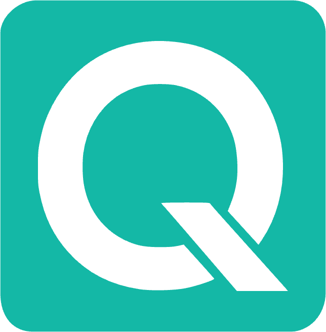
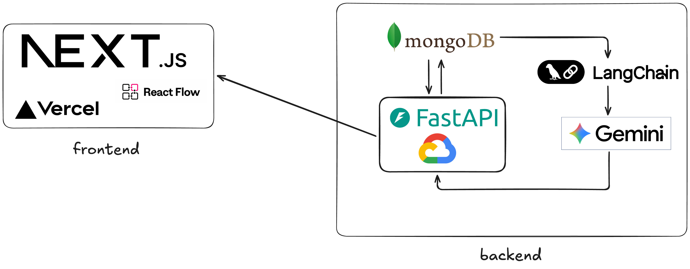

<div align="center">



# PreFlight

### The Architecture Planning Engine That Thinks Before You Build

[](https://github.com/dwseoh/Quota&label=stars)
[](https://github.com/dwseoh/Quota/network/members&label=forks)

**Innovation shouldn't come with a surprise bill.**

<br/>

<kbd>

</kbd>

</div>

<br/>

---

<div align="center">

`Plan` · `Simulate` · `Optimize` · `Ship`

</div>

---

## The Problem

Every engineering team has shipped an architecture that looked right on a whiteboard — then watched costs spiral, services collapse under load, and migration become a six-month nightmare.

**PreFlight eliminates that.** It's a real-time architecture intelligence engine that understands your system before a single line of code is written. It catches the $50K mistake before it becomes one.

---

## How It Works

```
   You describe what you're building
              ↓
   AI Architect asks surgical questions
              ↓
   Generates a complete architecture graph
              ↓
   Scores it across 8 dimensions in real-time
              ↓
   Continuously optimizes as you iterate
```

---

## Core Capabilities

### Architecture Studio

The visual workspace where systems come to life.

- **Drag-and-Drop Canvas** — 60+ cloud-native components across 12 categories. Build production-grade architectures in minutes.
- **Real-Time Cost Simulation** — Every component is priced. Adjust user scale from 100 to 10M and watch costs recalculate instantly.
- **8-Dimensional Scoring** — Build speed, complexity, scalability, cost, ops burden, vendor lock-in, reliability, AI readiness. Scored live.
- **Intelligent Linting** — 20+ architecture rules catch missing auth layers, single points of failure, unprotected databases, and anti-patterns before they hit production.
- **Auto-Fix with Approval** — One-click fixes for every lint issue. Preview changes, compare versions, approve or reject. Your architecture, your rules.
- **Version History** — Every change is snapshotted. Restore any previous state. Compare architectures side by side.

### AI Architect (Gemini-Powered)

Two-phase intelligence that adapts to your project.

- **Planning Chat** — Describe what you're building. The AI asks 3-5 high-signal questions, then generates a complete stack recommendation with per-component justification and cost estimates.
- **Workspace Chat** — Once you're on the canvas, the AI sees everything: your nodes, edges, constraints, lint issues, and recent actions. It references your planning history. It never asks what you already told it.
- **Context Continuity** — The workspace AI has full memory of your planning conversations. It knows your goals, constraints, budget, timeline, and tech preferences.

### VS Code Extension

Shift-left cost intelligence directly in your editor.

- **Cost Heatmaps** — Highlights expensive code blocks (LLM calls, DB queries, API requests) with inline price annotations.
- **Smart Detection** — AST-level parsing identifies 10+ cost-impacting patterns: unbatched loops, SELECT *, missing cache layers, redundant API calls.
- **Budget Projections** — Simulates monthly burn at any user scale. See what your code costs before it ships.
- **One-Click Optimization** — Actionable suggestions with estimated savings.

---

## Architecture

```
┌─────────────────────────────────────────────────────────────┐
│                     PreFlight Platform                       │
├──────────────────────┬──────────────────────────────────────┤
│   VS Code Extension  │         Web Architecture Studio      │
│   ┌───────────────┐  │  ┌────────────┐    ┌──────────────┐ │
│   │ AST Parser    │  │  │ Next.js    │    │ FastAPI      │ │
│   │ Cost Engine   │  │  │ React Flow │    │ Gemini AI    │ │
│   │ CodeLens      │  │  │ Zustand    │    │ RAG Engine   │ │
│   │ Gemini AI     │  │  │ Convex     │    │ Cost Engine  │ │
│   └───────────────┘  │  └────────────┘    └──────────────┘ │
└──────────────────────┴──────────────────────────────────────┘
```

| Layer | Stack |
|-------|-------|
| **Frontend** | Next.js 14, React Flow, Tailwind CSS, Zustand, Convex |
| **Backend** | Python, FastAPI, LangChain, FAISS |
| **AI** | Google Gemini 2.5 Flash |
| **Database** | Convex (real-time), FAISS (vector store) |
| **Extension** | TypeScript, Tree-sitter, VS Code API |

---

## Quick Start

### Web Architecture Studio

**Backend:**

```bash
cd web-dashboard/backend
python -m venv venv && source venv/bin/activate
pip install -r requirements.txt
python -m app.main
```

**Frontend:**

```bash
cd web-dashboard/frontend
npm install
npx convex dev --once    # initialize Convex schema
npm run dev
```

Open `http://localhost:3000` — start planning.

### VS Code Extension

```bash
cd vscode-extension
npm install
npm run compile
```

Press `F5` to launch the extension host.

### Environment Variables

```bash
# .env (root)
GEMINI_API_KEY=your_gemini_api_key
NEXT_PUBLIC_CONVEX_URL=your_convex_url
CONVEX_DEPLOYMENT=your_convex_deployment
```

---

## Design Philosophy

> **"The best architecture is the one you never have to rewrite."**

PreFlight is built on three principles:

1. **Simulate before you build.** Every architecture decision should be stress-tested against real constraints — budget, team size, timeline, traffic — before code is written.

2. **AI should augment, not replace.** The AI Architect proposes. You approve. Every auto-fix is staged, diffed, and reversible. The human always has final say.

3. **Cost is a first-class citizen.** Infrastructure cost isn't an afterthought. It's embedded into every component, every recommendation, every score.

---

<div align="center">

**PreFlight** — Because the best time to fix your architecture is before you build it.

<br/>

<sub>Built with obsessive attention to detail.</sub>

</div>
