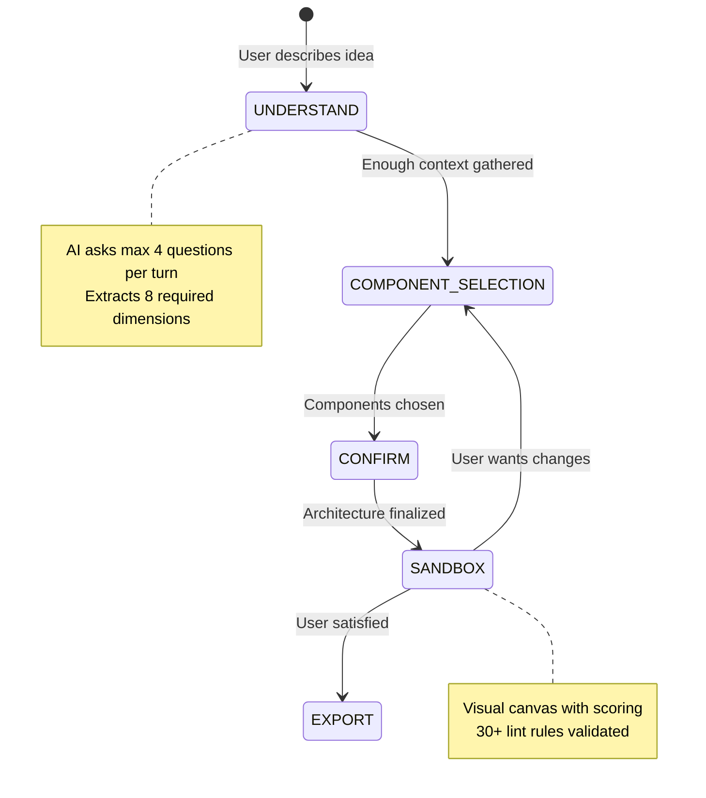
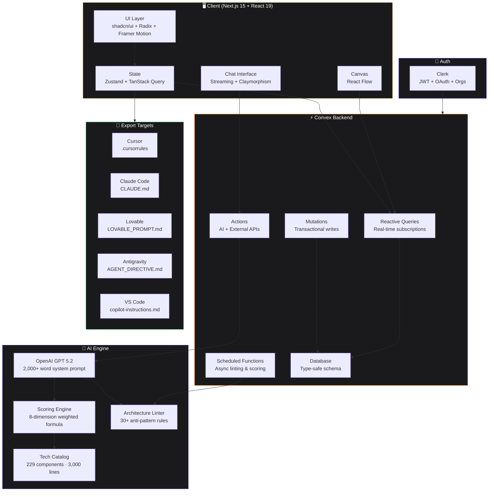

<div align="center">

<!-- HERO BANNER -->


<!-- TAGLINE -->
<br />

<h3>The AI architect that designs your stack before you code.</h3>
<p><em>229+ technologies · 8-dimension scoring · 30+ lint rules · one-click IDE export</em></p>

<br />

<!-- BADGES ROW 1 -->
[](https://nextjs.org)
[](https://convex.dev)
[](https://openai.com)
[](https://typescriptlang.org)
[](https://tailwindcss.com)
[](https://clerk.com)

<br />

<!-- BADGES ROW 2 -->


<br />
<br />

<!-- HERO SCREENSHOT -->
<picture>
  <source media="(prefers-color-scheme: dark)" srcset="public/screenshots/hero-dark.png">
  <source media="(prefers-color-scheme: light)" srcset="public/screenshots/hero-light.png">
  
</picture>

<br />
<br />

[🚀 **Try Preflight**](https://preflight.dev) · [📖 **Docs**](https://docs.preflight.dev) · [🐛 **Report Bug**](https://github.com/yourusername/preflight/issues) · [💡 **Request Feature**](https://github.com/yourusername/preflight/issues)

</div>

<br />

---

<br />

## ⚡ The Problem

Every developer starts the same way. You have an idea. You open Cursor. You start prompting.

**72 hours later** you realize your database can't handle relational queries, your auth costs $500/mo at scale, and your AI pipeline has no queue so users stare at a spinner for 40 seconds.

> The wrong architecture costs startups **$50,000+** in rewrites.
> Every AI tool helps you write code faster. **None of them ask if you should.**

**Preflight fixes that in 60 seconds.**

<br />

## 🧠 What is Preflight?

Preflight is the **world's first AI-powered architecture planning platform**. It sits *before* your IDE and ensures every line of code is built on the right foundation.

<div align="center">
<table>
<tr>
<td align="center" width="25%">

### 💬
### Describe
Tell Preflight your idea in plain English

</td>
<td align="center" width="25%">

### 🔍
### Interrogate
AI asks smart follow-ups like a $400/hr architect

</td>
<td align="center" width="25%">

### 🏗️
### Architect
Get a scored, linted, visual architecture

</td>
<td align="center" width="25%">

### 🚀
### Export
One-click to Cursor, Claude Code, Lovable, or VS Code

</td>
</tr>
</table>
</div>

<br />

## ✨ Features

<div align="center">
<table>
<tr>
<td width="50%">

### 🎯 229+ Technology Catalog
~3,000 lines of hand-scored TypeScript data. Every technology from **SQLite to Kubernetes** with 8-dimensional scores, real company usage data, cost estimates, maturity ratings, and best-for/avoid-when tags.

**22 categories**: Frontend, Backend, Database, Auth, AI/ML, Mobile, Desktop, Hosting, Payments, Messaging, Search, Monitoring, CI/CD, Storage, CMS, Realtime, Email, Testing, API Tools, Blockchain, Gaming, IoT

</td>
<td width="50%">

### 📊 8-Dimension Scoring Engine
Every technology scored across **build speed, complexity, scalability, cost, ops burden, vendor lock-in, reliability, and AI-readiness**. Weights shift based on your project constraints.

A hackathon project and an enterprise app get genuinely different recommendations from the same catalog.

```
Firebase  → Hackathon: 9.2 | Enterprise: 4.1
PostgreSQL → Hackathon: 5.8 | Enterprise: 9.4
```

</td>
</tr>
<tr>
<td width="50%">

### 🔬 Architecture Linter
**30+ lint rules** catch real anti-patterns before they cost you weeks:

- ❌ No queue for async AI processing
- ❌ Auth provider without MFA support
- ❌ Single-point-of-failure database
- ❌ Enterprise DB for a hackathon
- ❌ No CDN for static assets
- ❌ AI calls with no cost cap

</td>
<td width="50%">

### 🔌 One-Click IDE Export
Tool-specific artifacts, not generic READMEs:

| Target | Artifacts |
|--------|-----------|
| **Cursor** | `.cursorrules` + `ARCHITECTURE.md` |
| **Claude Code** | `CLAUDE.md` + `TASKS.md` |
| **Lovable** | `LOVABLE_PROMPT.md` |
| **Antigravity** | `AGENT_DIRECTIVE.md` |
| **VS Code** | `copilot-instructions.md` |

</td>
</tr>
</table>
</div>

<br />

## 🎬 How It Works


<div align="center">

### The State Machine

</div>



<br />

## 🛠️ Tech Stack

<div align="center">

### Frontend

[](https://react.dev)
[](https://nextjs.org)
[](https://typescriptlang.org)
[](https://tailwindcss.com)
[](https://ui.shadcn.com)
[](https://radix-ui.com)
[](https://www.framer.com/motion)

### State & Data

[](https://zustand-demo.pmnd.rs)
[](https://tanstack.com/query)
[](https://reactflow.dev)

### Backend & AI

[](https://convex.dev)
[](https://openai.com)
[](https://clerk.com)

### DevOps

[](https://vercel.com)
[](https://github.com/features/actions)
[](https://turbo.build)
[](https://eslint.org)
[](https://prettier.io)

</div>

<br />

## 🏗️ Architecture



<br />

## 📊 The Scoring System

Every technology in our catalog is evaluated using a weighted multi-dimensional formula:

<div align="center">

```
Score(t, p) = Σ(wᵢ(p) · sᵢ(t)) / Σ(wᵢ(p))    for i = 1..8
```

</div>

| Dimension | What It Measures | Scale |
|-----------|-----------------|-------|
| ⚡ **Build Speed** | How fast can you ship v1? | 1-10 |
| 🧩 **Complexity** | Learning curve + moving parts | 1-10 |
| 📈 **Scalability** | Handles 10x-100x growth? | 1-10 |
| 💰 **Cost** | Monthly cost at moderate usage | USD |
| 🔧 **Ops Burden** | Maintenance / DevOps effort | 1-10 |
| 🔒 **Lock-in** | Vendor dependency | 1-10 |
| 🛡️ **Reliability** | Uptime / fault tolerance | 1-10 |
| 🤖 **AI-Readiness** | Native AI/ML support | 1-10 |

<details>
<summary><b>📋 Example: How weights shift by project type</b></summary>

<br />

| Dimension | 🏃 Hackathon | 🏢 Enterprise | 🤖 AI Startup | 💰 SaaS |
|-----------|-------------|--------------|--------------|---------|
| Build Speed | **3.0x** | 0.5x | 2.0x | 1.5x |
| Complexity | 0.5x | 1.0x | 1.0x | 1.0x |
| Scalability | 0.3x | **3.0x** | 2.0x | **2.5x** |
| Cost | 2.0x | 0.5x | 1.5x | 1.0x |
| Ops Burden | 0.3x | 1.5x | 1.0x | 1.5x |
| Lock-in | 0.2x | **2.5x** | 1.0x | 2.0x |
| Reliability | 0.5x | **3.0x** | 1.5x | **2.5x** |
| AI-Readiness | 1.0x | 0.5x | **3.0x** | 1.0x |

</details>

<br />

## 📁 Project Structure

```
preflight/
├── app/                          # Next.js 15 App Router
│   ├── (auth)/                   # Auth routes (Clerk)
│   ├── (dashboard)/              # Main app routes
│   │   ├── chat/                 # Chat-first interface
│   │   ├── sandbox/              # Visual architecture canvas
│   │   └── export/               # IDE export page
│   ├── api/                      # API routes
│   ├── layout.tsx                # Root layout (fonts, providers)
│   └── globals.css               # Tailwind + Claymorphism tokens
│
├── components/
│   ├── chat/                     # Chat UI components
│   │   ├── ChatPage.tsx          # Main chat container
│   │   ├── MessageBubble.tsx     # User/AI message rendering
│   │   ├── ChatInput.tsx         # Input with quick actions
│   │   ├── ComponentCard.tsx     # Technology selection cards
│   │   ├── ComponentGrid.tsx     # Grid layout for recommendations
│   │   └── TypingIndicator.tsx   # AI thinking animation
│   │
│   ├── canvas/                   # Architecture visualization
│   │   ├── ArchitectureCanvas.tsx  # React Flow wrapper
│   │   ├── TechNode.tsx          # Custom node component
│   │   ├── ScorePanel.tsx        # Dimension score breakdown
│   │   └── LintPanel.tsx         # Anti-pattern warnings
│   │
│   ├── export/                   # IDE export generators
│   │   ├── CursorExport.tsx      # .cursorrules generator
│   │   ├── ClaudeExport.tsx      # CLAUDE.md generator
│   │   ├── LovableExport.tsx     # Lovable prompt generator
│   │   └── ExportButton.tsx      # One-click export UI
│   │
│   └── ui/                       # shadcn/ui + Claymorphism
│       ├── button.tsx
│       ├── dialog.tsx
│       ├── dropdown.tsx
│       └── tooltip.tsx
│
├── convex/                       # Convex backend
│   ├── schema.ts                 # Database schema (type-safe)
│   ├── chat.ts                   # Chat mutations & queries
│   ├── architecture.ts           # Architecture CRUD
│   ├── scoring.ts                # Scoring engine actions
│   ├── linter.ts                 # Lint rule engine
│   └── ai.ts                     # GPT 5.2 integration
│
├── lib/
│   ├── component-weights.ts      # 229 technologies (3,000 lines)
│   ├── scoring-engine.ts         # 8-dimension formula
│   ├── lint-rules.ts             # 30+ architecture rules
│   ├── export-generators.ts      # Tool-specific artifact gen
│   └── prompts/
│       └── system-prompt.ts      # 2,000+ word architect prompt
│
├── public/
│   └── screenshots/              # App screenshots
│
├── tailwind.config.ts            # Tailwind v4 + clay tokens
├── convex.config.ts              # Convex configuration
├── next.config.ts                # Next.js configuration
├── tsconfig.json                 # TypeScript strict mode
└── package.json
```

<br />

## 🚀 Quick Start

### Prerequisites

- **Node.js** 18+
- **pnpm** (recommended) or npm
- **Convex** account ([convex.dev](https://convex.dev))
- **Clerk** account ([clerk.com](https://clerk.com))
- **OpenAI** API key ([platform.openai.com](https://platform.openai.com))

### Installation

```bash
# Clone the repository
git clone https://github.com/yourusername/preflight.git
cd preflight

# Install dependencies
pnpm install

# Set up environment variables
cp .env.example .env.local
```

### Environment Variables

```env
# Convex
CONVEX_DEPLOYMENT=your-deployment
NEXT_PUBLIC_CONVEX_URL=https://your-deployment.convex.cloud

# Clerk
NEXT_PUBLIC_CLERK_PUBLISHABLE_KEY=pk_live_xxxxx
CLERK_SECRET_KEY=sk_live_xxxxx

# OpenAI
OPENAI_API_KEY=sk-xxxxx
```

### Run

```bash
# Start Convex backend
pnpm convex dev

# Start Next.js frontend (in another terminal)
pnpm dev
```

Open [http://localhost:3000](http://localhost:3000) and start planning.

<br />

## 🗺️ Roadmap

<div align="center">

| Status | Feature | Description |
|--------|---------|-------------|
| ✅ | **Chat-First Interface** | Conversational architecture discovery |
| ✅ | **229 Tech Catalog** | 22 categories, 8-dimension scoring |
| ✅ | **Architecture Linter** | 30+ anti-pattern detection rules |
| ✅ | **Visual Canvas** | Interactive architecture graph |
| ✅ | **One-Click Export** | Cursor, Claude Code, Lovable, VS Code |
| ✅ | **Claymorphism Design** | Professional dark theme, gold accents |
| 🔜 | **Stripe Subscriptions** | Free + Pro tiers, launching in days |
| 🔮 | **Agentic Builder** | AI scaffolds entire codebase from architecture |
| 🔮 | **Multi-LLM Council** | Claude + GPT + Gemini debate your architecture |
| 🔮 | **Architecture Marketplace** | Share, fork, remix community templates |

</div>

<br />

## 🤝 Contributing

Contributions make Preflight better. Here's how you can help:

1. **Fork** the repository
2. **Create** a feature branch (`git checkout -b feature/amazing-feature`)
3. **Commit** your changes (`git commit -m 'Add amazing feature'`)
4. **Push** to the branch (`git push origin feature/amazing-feature`)
5. **Open** a Pull Request

### Contribution Ideas

- 🆕 Add new technologies to the catalog (`lib/component-weights.ts`)
- 🔬 Write new lint rules (`lib/lint-rules.ts`)
- 🎨 Improve UI components
- 📖 Improve documentation
- 🐛 Fix bugs

<br />

## 📜 License

Distributed under the **MIT License**. See `LICENSE` for details.

<br />

## 💬 Contact

Have questions? Found a bug? Want to collaborate?

[](https://twitter.com/yourusername)
[](https://linkedin.com/in/yourusername)
[](mailto:you@email.com)

<br />

---

<div align="center">


<br />

**Built with 🤎 by the Preflight team**

*The 60 seconds that saves you 60 days.*

<br />

⭐ **Star this repo if Preflight saved your architecture** ⭐

</div>
